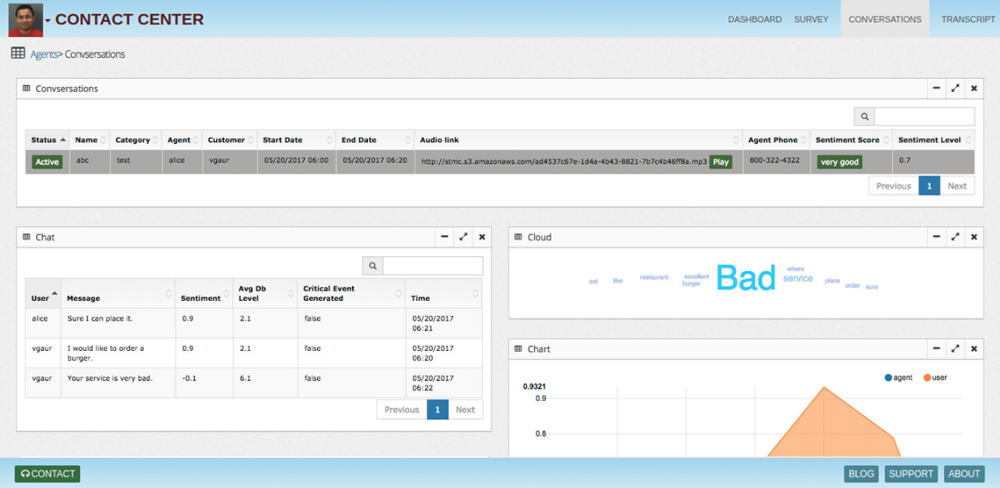
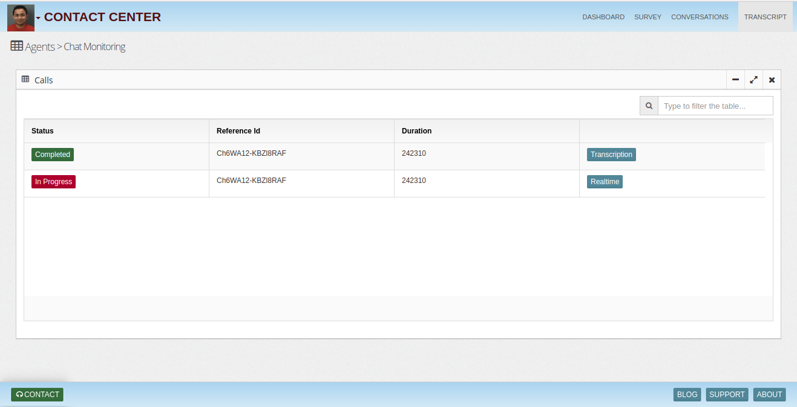
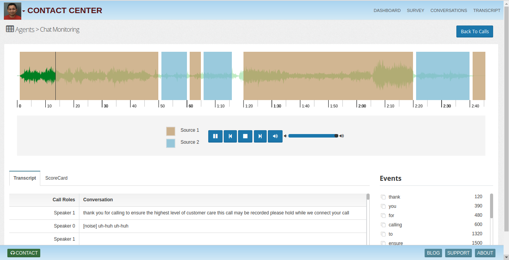
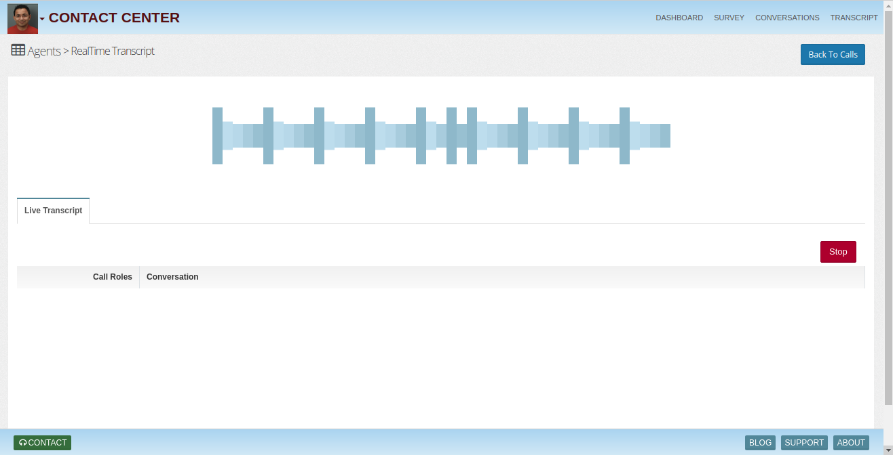
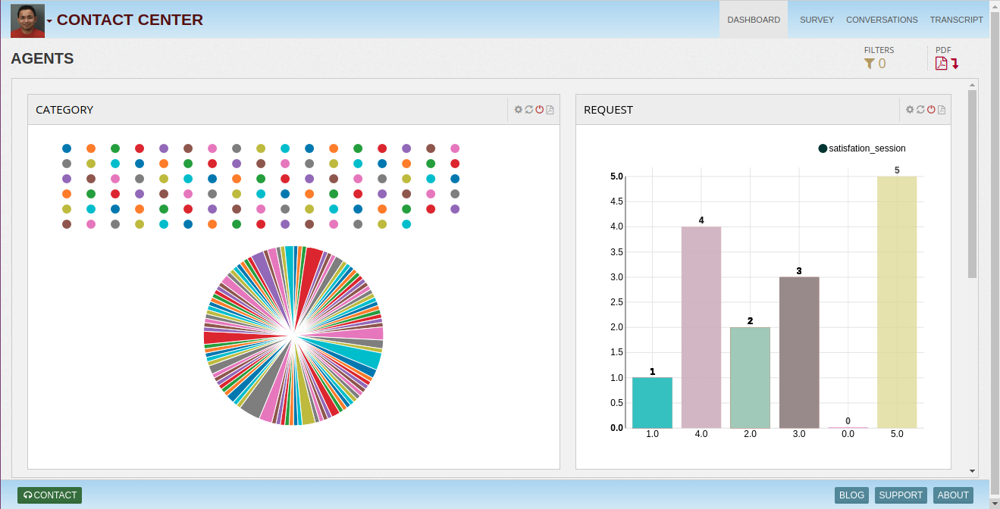
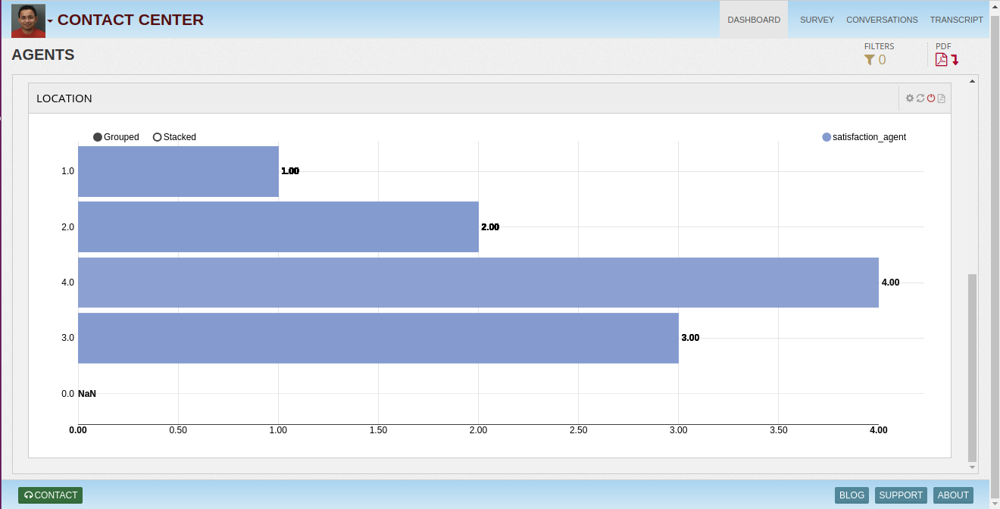

# Call-Insights
Get insights from live conversations

## Caller Profile
Who is the caller - caller ids linked to an account
Usually locations from where calls come
Usually which devices caller calls from
Usually which carriers, gateways calls comes from
Caller voice signature - voice tone, standardized modulation with db levels, words list
Caller natural language signature - Transcripts (Keywords modeling)
Usual actions performed in past - password change, money transfer..
Historical actions
Risk segmentation
Voice Signature
Like our finger prints every person's voice has a unique signature. When we take voice modulation, SNR, db levels etc over few seconds of window a unique voice signature is generated. This signature provides sufficient data to our voice identification deep learning models to detect right customer profile vs fraudster.

## Call Risk Score
Fraud solution includes complex machine learning based call risk scoring models. These models rely on call parameter's properties like reputation, weights, outlier buckets etc. Scoring is created from 0 to 100 range, 0 being the least risky call to 100 most risky.

Along with risk scores thresholds are provisioned to bucket calls in Low, Medium and High buckets for operational analysis.

## Link Analysis
Fraud solution enables fraud ops team to maintain fraudulent caller database and performs link analysis with voice to detect if the caller is a known fraudster.

## Call Monitoring
Fraud solution monitors every call, creates risk scores and capture relevant details for operations team to drill down risky calls.

## Call Exploration
Operations teams can search calls and drill down in details very easily using an intuitive interface.

## Call Transcription

## Dashboard

To learn more, check out [http://www.insightlake.com/call-insights.html](http://www.insightlake.com/call-insights.html)

Installation
------
* Download or clone the repository. 
* Run bin/insightlake command.
* Open browser with URL as http://localhost:8080/
* Change configuration in /conf folder to set different ports
* By default H2 database is used, you can change the database details in jdbc.properties file

License
------
InsightLake Call Insights is a commercial product but distributed to be used freely. Please contact contact@insightlake.com for details.

Getting Help
----------

You can get help easily :
Community - Google Groups
Slack Channel
Twitter
Facebook
Email: contact@insightlake.com
